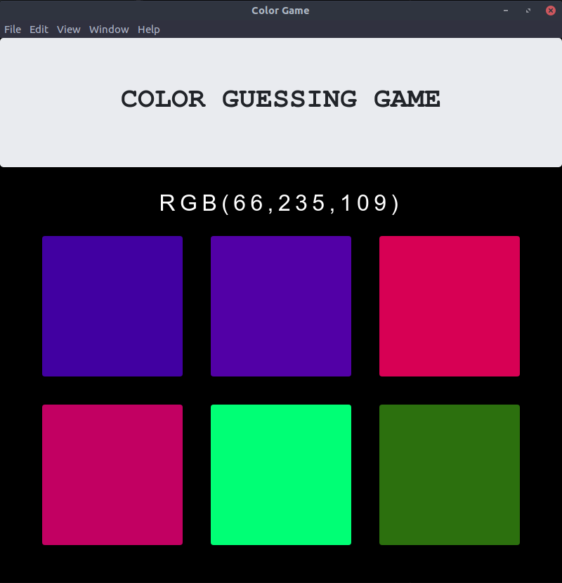

## Introduction
A small color guessing game made using js. Uses Electronjs for making it a simple **GUI**. You just have to guess the color based on rgb value shown.

## Screenshot :camera:


## Running :runner:
You need to have Node.js installed.

To install dependicies : 
```bash
$ npm install 
```
to run 
```bash
$ npm start
```

#### Contact
Would love to hear from you .

:email: gurkirat.singh@students.iiit.ac.in